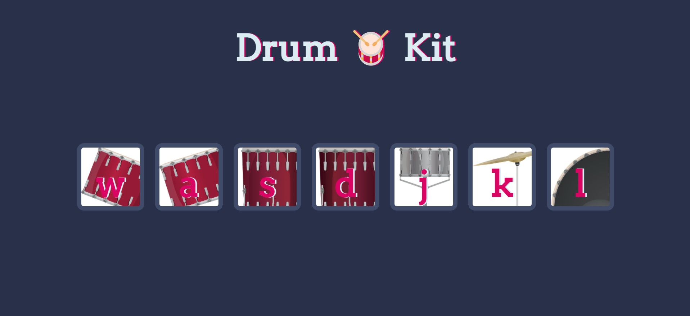

# Drums

<h4>A basic webpage created using HTML, CSS and jQuery. The user can play the drums by pressing keyboard keys or by clicking on the images</h4>

<p align="center">
  <a href="#key-features">Key Features</a> •
  <a href="#download">Download</a> •
  <a href="#screenshots">Screenshots</a> 
</p>

## Key Features

- **The user can play drums by pressing keyboard keys or clicking the images of the drums.**

## Download

Execute the following commands on the Command Line.

```bash
# Clone this repository
$ git clone https://github.com/ShauryaMagar/tinDog/

# Go into the repository
$ cd drums

# Open index.html
```

## Screenshots

<br>

<br>


> GitHub &nbsp;&middot;&nbsp; [@ShauryaMagar](https://github.com/ShauryaMagar)
